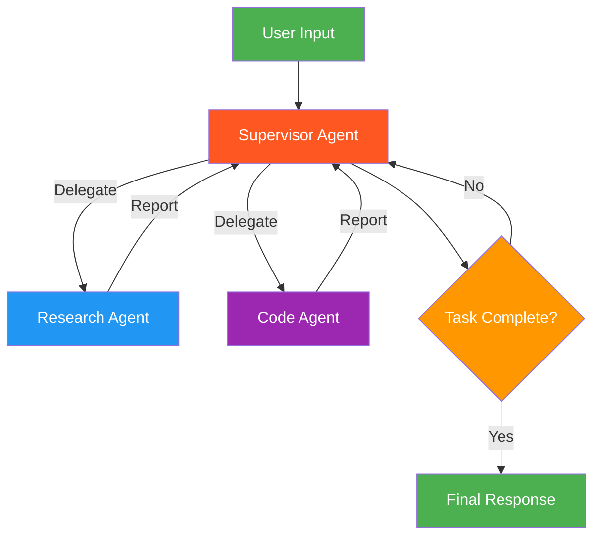

# 📊 Data-Driven Market Analyzer

A **multi-agent market analysis system** built on the **Supervisor (Hierarchical)** agentic architecture pattern. A central supervisor agent coordinates specialized research and analysis agents iteratively to produce comprehensive, data-driven market comparison reports.

> **Part of:** [Agentic AI Architectures](https://saisrinivas-samoju.github.io/agentic_architectures/) — a collection of mini-projects demonstrating different agentic design patterns.

---

## 🏗️ Architecture — Supervisor (Hierarchical)

The **Supervisor pattern** places a central supervisor agent that controls all communication flow and task delegation among specialized worker agents. The supervisor decides which agent to invoke next based on the current context, receives the agent's output, and determines the next step. Unlike the Orchestrator-Worker pattern, the supervisor maintains an ongoing conversation and can **re-invoke agents iteratively**.



### When to Use

- When multiple specialized agents need coordinated, multi-turn interaction
- Tasks requiring iterative back-and-forth between different specialists
- When you need centralized control over agent execution order
- Complex workflows where the supervisor must reason about what to do next

### Benefits

| Benefit         | Description                                          |
| --------------- | ---------------------------------------------------- |
| Central Control | Single point of coordination and decision-making     |
| Iterative       | Can loop back to agents based on intermediate results |
| Specialization  | Each worker agent is an expert in its domain         |
| Observability   | All communication flows through the supervisor       |

---

## 🤖 Agents

| Agent            | Role                     | Tools              | Description                                                                                              |
| ---------------- | ------------------------ | ------------------- | -------------------------------------------------------------------------------------------------------- |
| **Supervisor**   | Project Manager          | —                   | Coordinates the workflow, decides which agent to invoke next, compiles the final analysis                |
| **Researcher**   | Market Research Specialist | `web_search`       | Searches the web for data on job markets, salaries, industry trends, and economic indicators             |
| **Coder**        | Data Analyst             | `run_code`          | Writes and executes Python code to calculate statistics, comparisons, and format results into tables     |

---

## 🛠️ Tech Stack

- **LLM**: [OpenAI GPT-4o](https://platform.openai.com/) via `langchain-openai`
- **Agent Framework**: [LangChain](https://www.langchain.com/) + [LangGraph](https://langchain-ai.github.io/langgraph/)
- **Supervisor**: [`langgraph-supervisor`](https://pypi.org/project/langgraph-supervisor/) for hierarchical agent coordination
- **Web Search**: [DuckDuckGo Search](https://pypi.org/project/duckduckgo-search/) (no API key needed)
- **Caching**: SQLite-based LLM response cache via `langchain-community`
- **UI**: [Streamlit](https://streamlit.io/) for the interactive web interface
- **Package Manager**: [uv](https://docs.astral.sh/uv/)

---

## 📁 Project Structure

```
market_analyzer/
├── main.py              # Core agent definitions, supervisor workflow, and CLI entry point
├── run.py               # Streamlit web UI for interactive market analysis
├── pyproject.toml       # Project metadata and dependencies
├── uv.lock              # Locked dependency versions
├── .env                 # OpenAI API key (not tracked in git)
└── .gitignore
```

---

## 🚀 Getting Started

### Prerequisites

- **Python** ≥ 3.10
- **[uv](https://docs.astral.sh/uv/getting-started/installation/)** — Fast Python package manager
- **OpenAI API Key** — Get one at [platform.openai.com](https://platform.openai.com/)

### Installation

1. **Clone the repository**

   ```bash
   git clone https://github.com/govardhan-26/Market-Analyzer.git
   cd Market-Analyzer
   ```

2. **Install dependencies**

   ```bash
   uv sync
   ```

3. **Set up environment variables**

   Create a `.env` file in the project root:

   ```env
   OPENAI_API_KEY=your_openai_api_key_here
   ```

### Running the App

#### Streamlit Web UI (Recommended)

```bash
uv run streamlit run run.py
```

Then open **http://localhost:8501** in your browser.

#### Command Line

```bash
uv run python main.py
```

This runs a default comparison query and prints the analysis to the terminal.

---

## 💡 Example Queries

- *"Compare the tech job market in the US vs UK: salaries, demand, and top cities"*
- *"Compare AI/ML engineer salaries in Germany vs Canada"*
- *"Analyze the fintech job market growth in Singapore vs Australia"*
- *"Compare remote work trends in tech: US vs Europe"*

---

## ⚙️ How It Works

1. **User submits a query** via the Streamlit UI or command line
2. **Supervisor agent** receives the query and plans the workflow
3. **Researcher agent** is delegated to search the web for market data on both sides of the comparison
4. **Coder agent** is delegated to analyze the data — calculating statistics, percentage differences, and formatting comparison tables
5. **Supervisor iterates** — if more data is needed, the researcher is invoked again
6. **Final report** is compiled with both qualitative insights and quantitative data

---

## 📚 Learn More

- [LangGraph Supervisor Docs](https://langchain-ai.github.io/langgraph/concepts/multi_agent/#supervisor)
- [LangChain Documentation](https://docs.langchain.com/)

---


